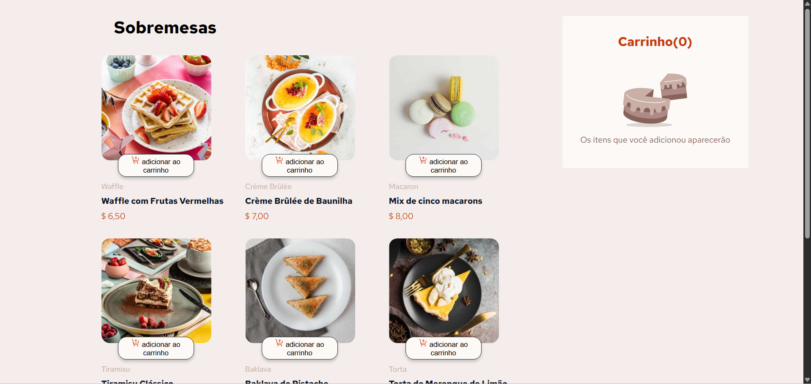
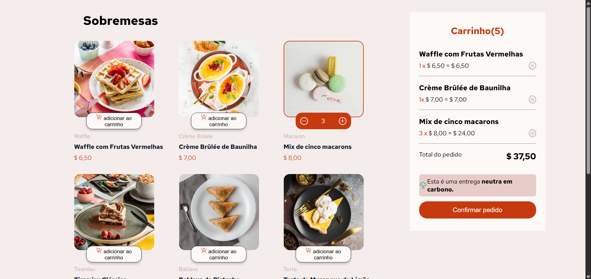
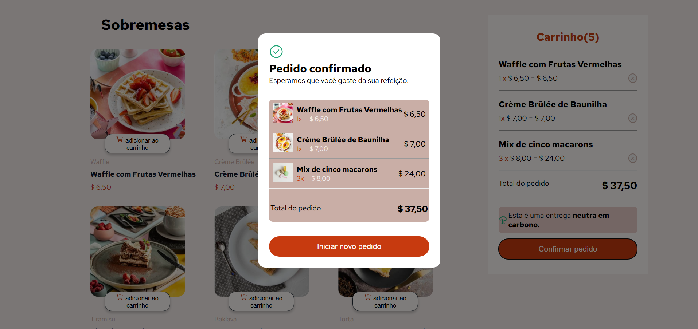

# 🍩 Dessert menu 

## 📖​ Description

### 🇺🇸 English
A dessert ordering website that allowns users to browse and place orders quickly and easily.

### 🇧🇷 Português
Um site de pedidos de sobremesas que permite ao usuário escolher e realizar pedidos de forma rápida, fácil e prática.

## 🧷​ Links

## ​📸​ Screenshot

  
  &nbsp;
  
  &nbsp;
  

## ​🛠️​ Built with

  
  
   

 

## ⚙️ Features

### 🇺🇸 English
- List of available desserts;
- Button to add items to the cart;
- Ability to increase or decrease the quantity of desserts with no limit;
- Shopping cart with option to remove items and view the total price;
- Button to complete the purchase;
- After completing the purchase, the user can view the selected desserts, with an option to return and place new orders.

### 🇧🇷 Português
- Lista de sobremesas disponíveis;
- Botão para adicionar itens ao carrinho;
- Possibilidade de aumentar ou diminuir a quantidade das sobremesas sem limite;
- Carrinho com opção de remover itens e visualizar o valor total;
- Botão para finalizar a compra;
- Ao finalizar a compra, o usuário visualiza as sobremesas selecionadas, com opção de voltar e realizar novos pedidos.

## ​💡​ What I learned
### 🇺🇸 English
This project was a challenge from Programathor, where I focused on improving my JavaScript skills. 
I learned how to structure data using arrays of objects, organizing a list of desserts in a way that makes it easier to manage and access.
I also improved my code organization by creating reusable functions to handle different actions within the application.

### 🇧🇷 Português
Este projeto foi um desafio do Programathor, onde busquei aprimorar meus conhecimentos em JavaScript.
Aprendi a estruturar dados utilizando arrays de objetos, organizando uma lista de sobremesas de forma que facilite o acesso e a manipulação.
Também melhorei a organização do código ao criar funções reutilizáveis para executar diferentes ações dentro da aplicação.

## 📌 Future improvements
### 🇺🇸 English
I plan to integrate React to make the application more dynamic and interactive, while also improving my development skills.

### 🇧🇷 Português
Pretendo integrar o React para tornar a aplicação mais dinâmica e interativa, além de aprimorar minhas habilidades como desenvolvedora.

## 📂 Project Structure
├── assets/
│   ├── fonts/
│   └── images/        # Images used in the application
├── css/
│   ├── reset.css
│   ├── responsive.css
│   └── style.css
├── js/
│   └── index.js
├── preview 
├── .gitignore
├── data.json
├── index.html
├── README.md

## 👩‍🦰 Author
- Luciane Kellen
-  

### 🇺🇸 English
💬 Aspiring front-end developer dedicated to improving my skills and building practical projects.

### 🇧🇷 Português
💬 Desenvolvedora front-end, dedicada a aprimorar minhas habilidades e criar projetos práticos.